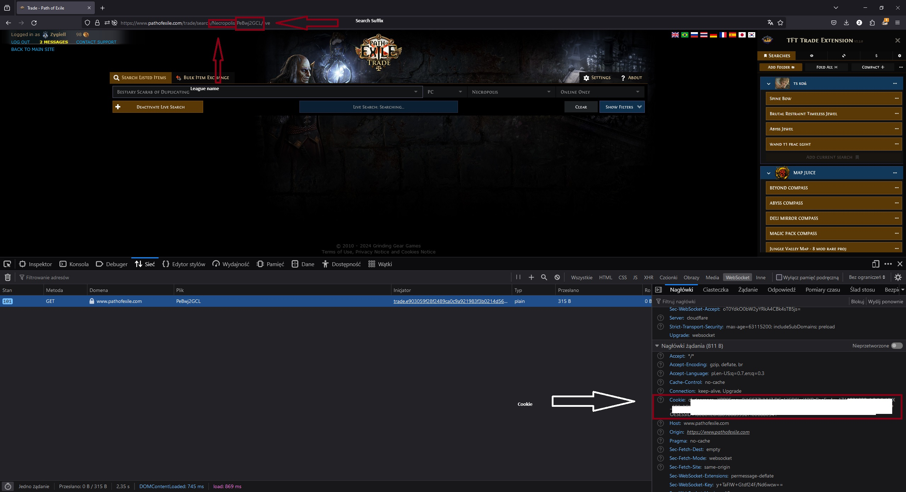

## Flipper
# Pre-requisites
.NET 6.0 Runtime is required, you can find it [here](https://dotnet.microsoft.com/en-us/download/dotnet/6.0/runtime?cid=getdotnetcore&os=windows&arch=x64) at Microsoft webpage

# Release
[Version 3.0.1](https://github.com/Zygiell/Flipper/releases/download/v3.0.1/Flipper_v3.0.1.zip)
# What to paste into config.json

## Changelog
3.0.1:
- Fixed the 'An error occurred: One of the identified items was in an invalid format' error when the price is a decimal.

3.0.0:
- Changed console output to readable version.

2.0.1:
- Changed config file from json to yaml.

2.0.0 :
- Added functionality for multiple search instances
- Added toggable sound notification on successfull whisper sent
